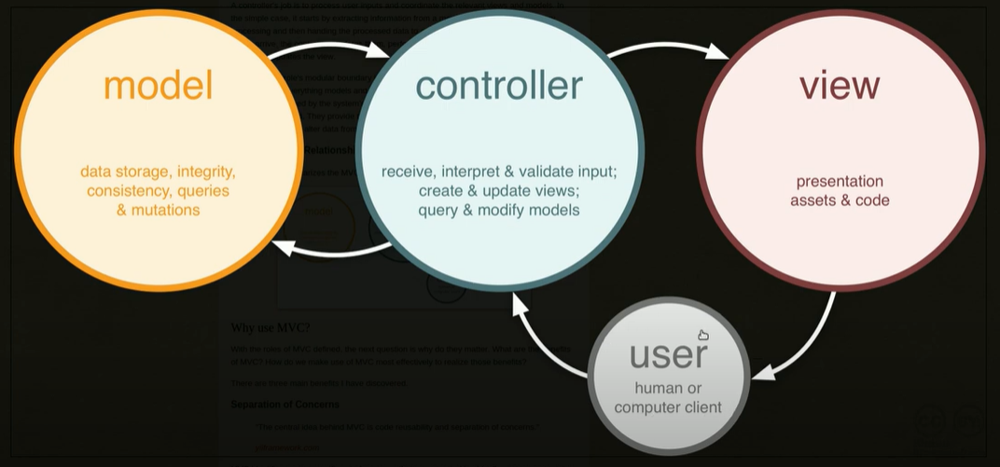
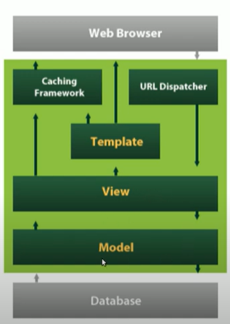
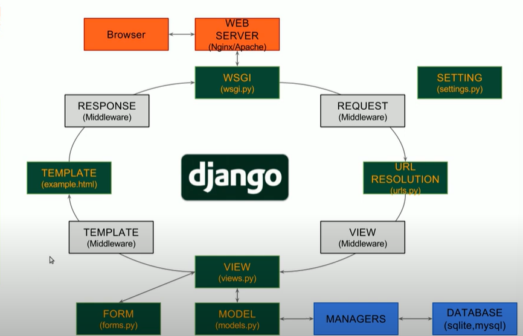
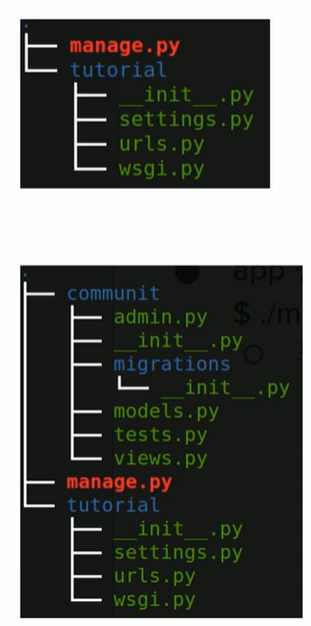
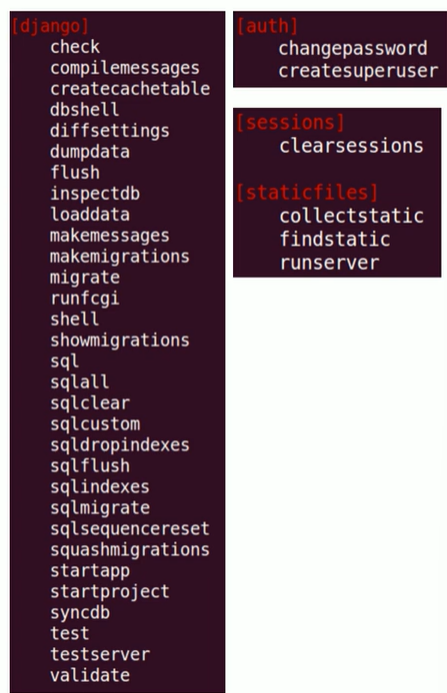

<h1>장고 개념 정리<h1>

<h2>MVC & MTV</h2>

<h3>MVC, MTV란</h3>

* Model
    * 안전하게 데이터를 저장
    * 사용자들이 웹사이트에서 입력한 데이터
* View
    * 데이터를 적절하게 유저에게 보여줌
    * 유저가 원하는 형태로
* Control, Template(Django)
    * 사용자의 입력과 이벤트에 반응하여 Model과 View를 업데이트

> 유저가 controller에서 다양한 event나 input 조작

> controller가 model에 있는 데이터를 가지고 와 가공하여 view에 전송

> 그 뷰를 다시 유저에게 전송

> MVC ➡️ 우리가 사용하는 거의 대부분의 소프트웨어 웹프로젝트가 이 세가지의 패턴으로 만들어지게 됨

<h2>Django 개념</h2>

<h2>Project와 app</h2>

* 프로젝트 생성

    $ django-admin startproject [프로젝트명]
    * urls.py
    * wsgi.py
    * settings.py: 전체 프로젝트 관리 설정파일
* App 생성

    $ ./manage.py startapp community
    * 프로젝트 내부에 다수의 app 생성
    * 게시판, QnA 등등 각각 분리
    * app은 다른 프로젝트에서도 사용가능
<h2>settings.py</h2>

프로젝트 환경 설정 파일

* DEBUG
    * 배포할 때는 false
    * 디버그 모드 설정
* INSTALLED_APPS
    * pip로 설치한 앱 또는 본인이 만든 app을 추가
* MIDDEKWARE_CALSSES
    * request와 response 사이의 주요 기능 레이어
* TEMPLATES
    * Django template 관련 설정, 실제 뷰(html, 변수)
* DATABASES
    * 데이터베이스 엔진의 연결 설정
* STATIC_URL
    * 정적 파일의 URL(css, javascript, image, etc.)

<h2>manage.py</h2> 

* 프로젝트 관리 명령어 모음
* 주요 명령어
    1. startapp: 앱생성
    2. runserver: 서버 실행
    3. createsuperuser: 관리자 생성
    4. makemigrations app: 앱의 모델 변경 사항 체크
    5. migrate: 변경 사항을 DB 에 반영
    6. shell: 쉘을 통해 데이터 확인
    7. collectstatic: static 파일을 한 곳에 모음

<h1>실습</h1>
가상환경, 

django-admin으로 프로젝트 생성
./manage.py startapp community:앱생성

> 앱생성 부터 안돼서 migration이 안됨...